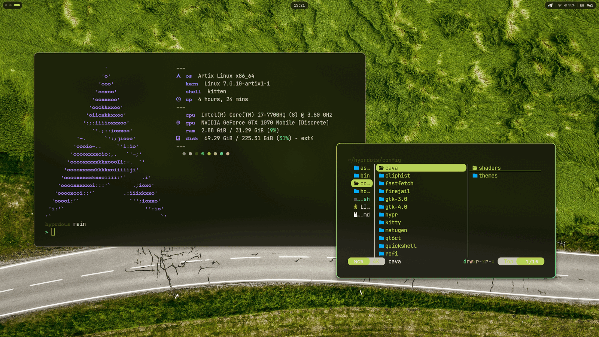
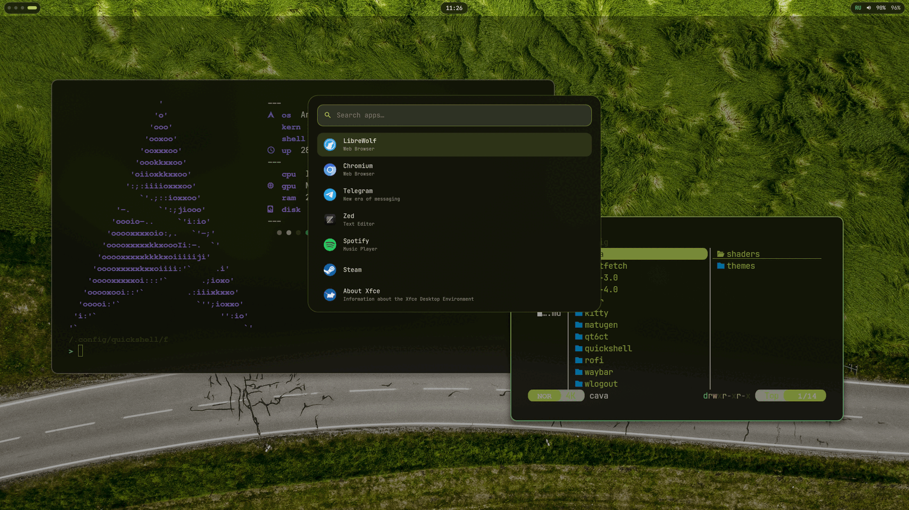

<div align="center">

# Hyprland Desktop

**A wallpaper-driven Wayland desktop for Arch and Artix Linux.**

Pick a wallpaper — the bar, the terminal, the notifications, the launcher and the lock screen
recolour themselves around it.

[English](#english) · [Русский](#русский)

`Hyprland` `Quickshell` `Waybar` `matugen` `hyprlock` `kitty` `zsh`

<br>



<table>
<tr>
<td></td>
<td></td>
</tr>
<tr>
<td align="center"><sub>launcher — <code>Super</code> + <code>D</code></sub></td>
<td align="center"><sub>audio panel — <code>Super</code> + <code>Shift</code> + <code>M</code></sub></td>
</tr>
</table>

</div>

---

## English

### What this is

A complete daily-driver desktop configuration for [Hyprland](https://hypr.land): window manager,
status bar, launcher, clipboard history, notifications, on-screen display, lock screen, terminal,
file manager and shell. Every colour in the system is derived from the current wallpaper by
[matugen](https://github.com/InioX/matugen) (Material You), so the desktop is never out of sync
with what is on the screen.

Two shell stacks ship side by side and can be swapped at runtime:

| Stack | Contents | Switch |
| --- | --- | --- |
| **Quickshell** (default) | custom bar, launcher, clipboard, notifications, volume/brightness OSD, wallpaper picker | `shell-switch qs` |
| **Waybar** | Waybar + dunst + rofi, with the same indicators: recording, brightness, volume, layout, battery | `shell-switch waybar` |

A watchdog supervises the active stack: if Quickshell dies, Waybar is brought up automatically, so
the desktop is never left without a bar.

### Install

One command. It fetches the repository, installs every dependency, backs up whatever is already
in place and generates the colour scheme:

```bash
bash <(curl -fsSL https://raw.githubusercontent.com/fedyaqq34356/hyprdots/main/install.sh)
```

Or, from a clone:

```bash
git clone https://github.com/fedyaqq34356/hyprdots.git
cd hyprdots
./install.sh
```

| Flag | Effect |
| --- | --- |
| `--dry-run` | print every action, change nothing |
| `--no-packages` | deploy the configuration only, install no packages |
| `-y`, `--yes` | do not ask for confirmation |

The installer requires `pacman`, must be run as a normal user (not root), and copies the previous
configuration to `~/.config/dotfiles-backup-<timestamp>` before writing anything.

### Theming

```
wallpaper ──▶ matugen ──┬──▶ hyprland   window borders
                        ├──▶ hyprlock   lock screen
                        ├──▶ quickshell bar, launcher, OSD
                        ├──▶ waybar     bar
                        ├──▶ kitty      terminal palette
                        ├──▶ rofi       launcher
                        ├──▶ dunst      notifications
                        └──▶ cava       audio visualiser
```

`~/.config/hypr/scripts/set-wallpaper.sh` is the single entry point: it paints every connected
monitor, persists the choice to `~/.config/hypr/current-wallpaper`, and re-runs matugen. Templates
live in `~/.config/matugen/templates` — add a file there plus one block in
`~/.config/matugen/config.toml` and any other application joins the scheme.

The lock screen reads the same source. `Super+Shift+L` runs a wrapper that regenerates the palette
if the wallpaper has changed since the last run, so the lock screen always shows the wallpaper that
is on the desktop right now — blurred, dimmed, behind a frosted card with the clock, the date, the
keyboard layout, uptime and battery.

### Power menu

`Super`+`P` opens a native Quickshell menu: the clock, uptime and battery over five tiles — lock,
sleep, log out, reboot, shut down. Each tile carries its own letter, so `l`, `s`, `e`, `r` and `p`
fire straight away; arrows move the selection, `Enter` confirms, `Escape` or a click outside
closes. Reboot and shutdown glow red instead of the theme accent, so the two irreversible entries
never look like the others.

It takes its colours from the wallpaper like everything else. Under the Waybar stack the same
binding falls back to wlogout, which now reads the matugen palette as well.

### Screen capture

`config/hypr/scripts/screenshot.sh` takes one argument and covers every case:

| Mode | What it grabs |
| --- | --- |
| `region` | an area drawn with the mouse |
| `window` | one window, snapped to its real geometry |
| `output` | the monitor under the cursor |
| `all` | every connected monitor in one image |
| `edit` | an area, then [satty](https://github.com/gabm/Satty) for arrows and blur |
| `color` | the colour under the cursor, hex into the clipboard |

The screen is frozen with `hyprpicker -r -z` while the selection is being drawn, so menus and
animations stay where they are. Every shot goes to `~/Pictures/Screenshots` **and** to the
clipboard, and the notification carries the image as its own thumbnail. Set `SCREENSHOT_DIR` to
save somewhere else.

### Screen recording

`config/hypr/scripts/record-toggle.sh` toggles: the first call starts, the second stops, whatever
mode started it.

| Argument | Effect |
| --- | --- |
| `screen` | the monitor under the cursor (default) |
| `region` | an area drawn with the mouse |
| `--mic` | record the microphone instead of the system output |
| `--no-audio` | video only |

By default the system output is recorded through the monitor source of the default sink, so a
recording carries the sound you actually heard. Files go to `~/Videos` (`RECORD_DIR` overrides it),
and the path of the finished file lands in the clipboard.

While something is being recorded the bar shows a pulsing red dot and the elapsed time — click it
to stop.

### The bar

Workspaces on the left, clock in the middle, and on the right: the recording indicator, tray,
keyboard layout, microphone state, output volume and battery. The layout badge (`EN` / `RU` / `UA` …) follows
`Alt`+`Shift` and can also be clicked to cycle layouts.

`Super`+`Shift`+`M` opens the audio panel: microphone and output volume on separate sliders, a mute
button on each, and the list of input devices — click one to make it the default microphone.
`Escape` closes the panel, `↑`/`↓` change the microphone level, `M` mutes it.

Volume, microphone and brightness all raise the same OSD card at the bottom of the focused screen.
Brightness goes through `brightnessctl -c backlight`; on machines that expose no backlight device
the OSD says so instead of the keys doing nothing at all.


### Keybindings

`Super` is the modifier.

| Key | Action |
| --- | --- |
| `Super` + `Return` | terminal (kitty) |
| `Super` + `T` | scratchpad terminal |
| `Super` + `D` | application launcher |
| `Super` + `E` | file manager |
| `Super` + `W` | wallpaper picker |
| `Super` + `V` | clipboard history |
| `Super` + `Shift` + `V` | wipe the clipboard and its history |
| `Super` + `P` | power menu |
| `Super` + `Q` | close window |
| `Super` + `F` | fullscreen |
| `Super` + `Shift` + `F` | toggle floating |
| `Super` + `H` / `J` / `K` / `L` | move focus (vim keys) |
| `Super` + arrows | move a floating window |
| `Super` + `Shift` + arrows | resize a window |
| `Super` + `1`…`9` | switch workspace |
| `Super` + `Shift` + `1`…`9` | move window to workspace |
| `Super` + `Shift` + `L` | lock screen |
| `Super` + `Shift` + `R` | reload Hyprland |
| `Super` + `Shift` + `E` | exit Hyprland |
| `Print` | screenshot of a selected area |
| `Shift` + `Print` | select an area and open the annotation editor |
| `Alt` + `Print` | screenshot of a window |
| `Super` + `Print` | screenshot of the current monitor |
| `Ctrl` + `Print` | screenshot of every monitor |
| `Super` + `Shift` + `S` | screenshot of a selected area |
| `Super` + `Shift` + `C` | colour picker, hex to the clipboard |
| `Super` + `Alt` + `R` | record the monitor, with system audio |
| `Super` + `Alt` + `Shift` + `R` | record a selected area |
| `Super` + `Shift` + `M` | audio panel (microphone and output) |
| `Super` + `M` | mute the microphone |
| `Super` + `Shift` + `=` / `-` | microphone volume |
| `Super` + `=` / `-` | output volume |
| brightness keys | screen brightness, with an OSD |
| `Super` + `Shift` + `F3` | cache cleanup |
| `Super` + `Shift` + `F4` | system update |

### Layout

```
config/
  hypr/          Hyprland, hyprlock, wallpaper and utility scripts
  quickshell/f/  the Quickshell stack (bar, launcher, clipboard, OSD, notifications)
  waybar/        the fallback bar
  matugen/       colour-scheme templates for every application
  firejail/      sandbox overrides shared by every profile
  cliphist/      clipboard history limits
  kitty/         terminal
  rofi/          launcher used by the Waybar stack
  cava/          audio visualiser themes and shaders
  wlogout/       power menu
  yazi/          file manager
  fastfetch/     system information
  gtk-3.0, gtk-4.0, qt6ct
  starship.toml  shell prompt
home/            .zshrc, .zshenv, .bashrc
bin/             shell-autostart, shell-switch, shell-watchdog
install.sh       automatic installer
```

Files generated at runtime — `colors.conf`, `lock-colors.conf`, `colors.css`, `Colors.qml`,
`current-wallpaper`, `hyprpaper.conf` — are deliberately not tracked; matugen writes them on the
first run.

### Requirements

Arch or Artix Linux with an AUR helper (the installer builds `yay` if none is present).

**Repositories:** hyprland · hyprlock · hyprpaper · hyprpolkitagent · xdg-desktop-portal-hyprland ·
waybar · kitty · rofi-wayland · dunst · cava · fastfetch · yazi · starship · zoxide · fzf · eza ·
bat · ripgrep · lazygit · thunar · brightnessctl · playerctl · pipewire · wireplumber · cliphist ·
wl-clipboard · grim · slurp · satty · hyprpicker · ffmpeg · imagemagick · qt6ct · kvantum · papirus-icon-theme ·
ttf-jetbrains-mono-nerd · zsh

**AUR:** quickshell · matugen-bin · wlogout · wf-recorder · wl-clip-persist

On Artix, install the service packages for your init system (`-openrc`, `-runit`, `-s6`) instead of
the systemd variants.

### Notes

* NVIDIA-specific environment variables live in `config/hypr/config/env.conf` — remove them on AMD
  or Intel hardware.
* Monitors are declared in `config/hypr/config/monitors.conf`; adjust it for your outputs.
* Wallpapers are read from `~/Pictures/Wallpapers` and rotate every three hours; the interval is
  set in `config/hypr/scripts/wallpaper-rotate.sh`.

### License

GNU General Public License v3.0 — see [LICENSE](LICENSE).

---

## Русский

### Что это

Полная конфигурация рабочего окружения на [Hyprland](https://hypr.land): оконный менеджер, панель,
лаунчер, история буфера обмена, уведомления, экранные индикаторы, экран блокировки, терминал,
файловый менеджер и оболочка. Все цвета в системе выводятся из текущих обоев через
[matugen](https://github.com/InioX/matugen) (Material You), поэтому оформление всегда совпадает с
тем, что на экране.

В комплекте два набора оболочки, переключаются на лету:

| Набор | Состав | Переключение |
| --- | --- | --- |
| **Quickshell** (по умолчанию) | своя панель, лаунчер, буфер обмена, уведомления, индикаторы громкости и яркости, выбор обоев | `shell-switch qs` |
| **Waybar** | Waybar + dunst + rofi, те же индикаторы: запись, яркость, громкость, раскладка, батарея | `shell-switch waybar` |

За активным набором следит watchdog: если Quickshell падает, автоматически поднимается Waybar —
рабочий стол не остаётся без панели.

### Установка

Одна команда: скачивает репозиторий, ставит все зависимости, делает резервную копию текущих
конфигов и генерирует цветовую схему.

```bash
bash <(curl -fsSL https://raw.githubusercontent.com/fedyaqq34356/hyprdots/main/install.sh)
```

Или из клона:

```bash
git clone https://github.com/fedyaqq34356/hyprdots.git
cd hyprdots
./install.sh
```

| Флаг | Действие |
| --- | --- |
| `--dry-run` | показать все шаги, ничего не менять |
| `--no-packages` | только разложить конфиги, пакеты не ставить |
| `-y`, `--yes` | не спрашивать подтверждения |

Установщику нужен `pacman`, запускать нужно от обычного пользователя (не от root). Предыдущая
конфигурация сохраняется в `~/.config/dotfiles-backup-<время>`.

### Оформление

```
обои ──▶ matugen ──┬──▶ hyprland   рамки окон
                   ├──▶ hyprlock   экран блокировки
                   ├──▶ quickshell панель, лаунчер, индикаторы
                   ├──▶ waybar     панель
                   ├──▶ kitty      палитра терминала
                   ├──▶ rofi       лаунчер
                   ├──▶ dunst      уведомления
                   └──▶ cava       визуализатор звука
```

Единая точка входа — `~/.config/hypr/scripts/set-wallpaper.sh`: он красит все подключённые
мониторы, сохраняет выбор в `~/.config/hypr/current-wallpaper` и перезапускает matugen. Шаблоны
лежат в `~/.config/matugen/templates` — добавьте туда файл и один блок в
`~/.config/matugen/config.toml`, и в общую схему войдёт любое другое приложение.

Экран блокировки берёт те же обои. `Super+Shift+L` запускает обёртку, которая пересобирает палитру,
если обои сменились с прошлого раза, — на локскрине всегда те обои, что стоят на рабочем столе:
размытые и притемнённые, поверх них матовая карточка с часами, датой, раскладкой клавиатуры,
аптаймом и зарядом батареи.

### Меню выключения

`Super`+`P` открывает меню Quickshell: часы, аптайм и заряд батареи над пятью плитками —
заблокировать, сон, выйти, перезагрузка, выключение. У каждой плитки своя буква, так что `l`, `s`,
`e`, `r` и `p` срабатывают сразу; стрелки двигают выбор, `Enter` подтверждает, `Escape` или клик
мимо закрывают. Перезагрузка и выключение подсвечиваются красным вместо цвета темы — два
необратимых пункта не выглядят как остальные.

Цвета берутся из обоев, как и везде. В наборе с Waybar та же клавиша открывает wlogout, который
теперь тоже читает палитру matugen.

### Скриншоты

`config/hypr/scripts/screenshot.sh` принимает один аргумент и закрывает все случаи:

| Режим | Что снимает |
| --- | --- |
| `region` | область, выделенную мышью |
| `window` | одно окно ровно по его границам |
| `output` | монитор под курсором |
| `all` | все подключённые мониторы одним снимком |
| `edit` | область, затем [satty](https://github.com/gabm/Satty) — стрелки, размытие, текст |
| `color` | цвет под курсором, hex в буфер обмена |

Пока идёт выделение, экран заморожен через `hyprpicker -r -z` — меню и анимации не убегают. Каждый
снимок попадает в `~/Pictures/Screenshots` **и** в буфер обмена, а уведомление показывает его же
миниатюрой. Другая папка задаётся переменной `SCREENSHOT_DIR`.

### Запись экрана

`config/hypr/scripts/record-toggle.sh` работает переключателем: первый вызов запускает, второй
останавливает — в каком бы режиме запись ни началась.

| Аргумент | Что делает |
| --- | --- |
| `screen` | монитор под курсором (по умолчанию) |
| `region` | область, выделенная мышью |
| `--mic` | писать микрофон вместо звука системы |
| `--no-audio` | только видео |

По умолчанию пишется звук системы — через monitor-источник текущего вывода, то есть в записи будет
то, что было слышно. Файлы уходят в `~/Videos` (меняется переменной `RECORD_DIR`), путь готового
файла попадает в буфер обмена.

Пока идёт запись, в панели мигает красная точка с таймером — клик по ней останавливает запись.

### Панель

Слева рабочие столы, по центру часы, справа — индикатор записи, трей, раскладка клавиатуры,
состояние микрофона, громкость и заряд батареи. Индикатор раскладки (`EN` / `RU` / `UA` …) следует за `Alt`+`Shift`, по
нему же можно кликнуть, чтобы переключить раскладку.

`Super`+`Shift`+`M` открывает панель звука: отдельные ползунки для микрофона и вывода, кнопка
отключения у каждого и список устройств ввода — клик выбирает микрофон по умолчанию. `Escape`
закрывает панель, `↑`/`↓` меняют уровень микрофона, `M` его выключает.

Громкость, микрофон и яркость показывают одну и ту же карточку внизу активного экрана. Яркость идёт
через `brightnessctl -c backlight`; если устройства подсветки в системе нет, индикатор так и
скажет, вместо того чтобы клавиши молча ничего не делали.


### Горячие клавиши

Модификатор — `Super`.

| Клавиши | Действие |
| --- | --- |
| `Super` + `Return` | терминал (kitty) |
| `Super` + `T` | выпадающий терминал |
| `Super` + `D` | лаунчер приложений |
| `Super` + `E` | файловый менеджер |
| `Super` + `W` | выбор обоев |
| `Super` + `V` | история буфера обмена |
| `Super` + `Shift` + `V` | стереть буфер обмена и его историю |
| `Super` + `P` | меню выключения |
| `Super` + `Q` | закрыть окно |
| `Super` + `F` | полный экран |
| `Super` + `Shift` + `F` | плавающее окно |
| `Super` + `H` / `J` / `K` / `L` | перемещение фокуса (vim-клавиши) |
| `Super` + стрелки | двигать плавающее окно |
| `Super` + `Shift` + стрелки | менять размер окна |
| `Super` + `1`…`9` | переключить рабочий стол |
| `Super` + `Shift` + `1`…`9` | перенести окно на рабочий стол |
| `Super` + `Shift` + `L` | блокировка экрана |
| `Super` + `Shift` + `R` | перезагрузить Hyprland |
| `Super` + `Shift` + `E` | выйти из Hyprland |
| `Print` | скриншот выделенной области |
| `Shift` + `Print` | выделить область и открыть редактор |
| `Alt` + `Print` | скриншот окна |
| `Super` + `Print` | скриншот текущего монитора |
| `Ctrl` + `Print` | скриншот всех мониторов |
| `Super` + `Shift` + `S` | скриншот выделенной области |
| `Super` + `Shift` + `C` | пипетка, hex в буфер обмена |
| `Super` + `Alt` + `R` | запись монитора со звуком системы |
| `Super` + `Alt` + `Shift` + `R` | запись выделенной области |
| `Super` + `Shift` + `M` | панель звука (микрофон и вывод) |
| `Super` + `M` | выключить микрофон |
| `Super` + `Shift` + `=` / `-` | громкость микрофона |
| `Super` + `=` / `-` | громкость вывода |
| клавиши яркости | яркость экрана, с индикатором |
| `Super` + `Shift` + `F3` | очистка кэша |
| `Super` + `Shift` + `F4` | обновление системы |

### Структура

```
config/
  hypr/          Hyprland, hyprlock, скрипты обоев и утилит
  quickshell/f/  набор Quickshell (панель, лаунчер, буфер, индикаторы, уведомления)
  waybar/        запасная панель
  matugen/       шаблоны цветовой схемы для всех приложений
  firejail/      общие правила песочницы для всех профилей
  cliphist/      ограничения истории буфера обмена
  kitty/         терминал
  rofi/          лаунчер для набора с Waybar
  cava/          темы и шейдеры визуализатора звука
  wlogout/       меню выключения
  yazi/          файловый менеджер
  fastfetch/     информация о системе
  gtk-3.0, gtk-4.0, qt6ct
  starship.toml  приглашение оболочки
home/            .zshrc, .zshenv, .bashrc
bin/             shell-autostart, shell-switch, shell-watchdog
install.sh       автоматический установщик
```

Файлы, которые создаются во время работы — `colors.conf`, `lock-colors.conf`, `colors.css`,
`Colors.qml`, `current-wallpaper`, `hyprpaper.conf` — намеренно не хранятся в репозитории: matugen
пишет их при первом запуске.

### Требования

Arch или Artix Linux, помощник AUR (если его нет, установщик соберёт `yay`).

**Репозитории:** hyprland · hyprlock · hyprpaper · hyprpolkitagent · xdg-desktop-portal-hyprland ·
waybar · kitty · rofi-wayland · dunst · cava · fastfetch · yazi · starship · zoxide · fzf · eza ·
bat · ripgrep · lazygit · thunar · brightnessctl · playerctl · pipewire · wireplumber · cliphist ·
wl-clipboard · grim · slurp · satty · hyprpicker · ffmpeg · imagemagick · qt6ct · kvantum · papirus-icon-theme ·
ttf-jetbrains-mono-nerd · zsh

**AUR:** quickshell · matugen-bin · wlogout · wf-recorder · wl-clip-persist

На Artix ставьте пакеты служб под свою систему инициализации (`-openrc`, `-runit`, `-s6`) вместо
systemd-вариантов.

### Замечания

* Переменные окружения для NVIDIA лежат в `config/hypr/config/env.conf` — на AMD и Intel их нужно
  убрать.
* Мониторы описаны в `config/hypr/config/monitors.conf`, поправьте под свои выходы.
* Обои берутся из `~/Pictures/Wallpapers` и меняются раз в три часа; интервал задаётся в
  `config/hypr/scripts/wallpaper-rotate.sh`.

### Лицензия

GNU General Public License v3.0 — см. [LICENSE](LICENSE).
