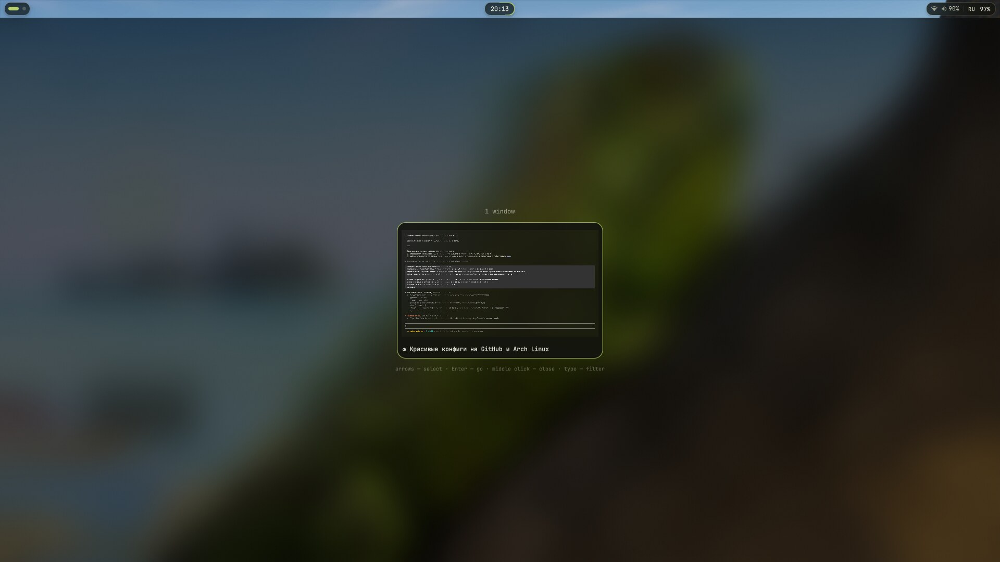
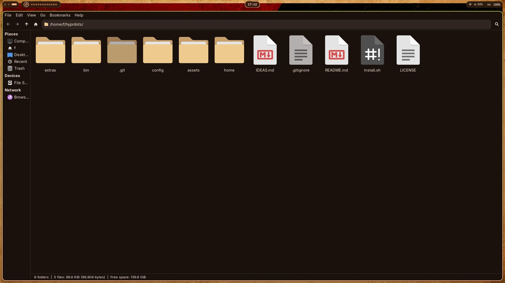

<div align="center">

# Hyprland Desktop

**A wallpaper-driven Wayland desktop for Arch and Artix Linux.**

Pick a wallpaper — the bar, the terminal, the notifications, the launcher and the lock screen
recolour themselves around it.

[English](#english) · [Русский](#русский)

`Hyprland` `Quickshell` `matugen` `hyprlock` `kitty` `zsh`

<br>


<table>
<tr>
<td></td>
<td></td>
</tr>
<tr>
<td align="center"><sub>overview — <code>Super</code> + <code>Tab</code></sub></td>
<td align="center"><sub>launcher — <code>Super</code> + <code>D</code></sub></td>
</tr>
<tr>
<td></td>
<td></td>
</tr>
<tr>
<td align="center"><sub>volume — the wave takes its shape from the spectrum</sub></td>
<td align="center"><sub>notifications — the border counts the time down</sub></td>
</tr>
<tr>
<td></td>
<td></td>
</tr>
<tr>
<td align="center"><sub>system — <code>Super</code> + <code>F1</code></sub></td>
<td align="center"><sub>calendar — days shaded by commit count</sub></td>
</tr>
<tr>
<td></td>
<td></td>
</tr>
<tr>
<td align="center"><sub>Wi-Fi — <code>Super</code> + <code>N</code></sub></td>
<td align="center"><sub>audio — <code>Super</code> + <code>Shift</code> + <code>M</code></sub></td>
</tr>
<tr>
<td></td>
<td></td>
</tr>
<tr>
<td align="center"><sub>player — <code>Super</code> + <code>M</code></sub></td>
<td align="center"><sub>clipboard — <code>Super</code> + <code>V</code></sub></td>
</tr>
<tr>
<td></td>
<td></td>
</tr>
<tr>
<td align="center"><sub>wallpapers — <code>Super</code> + <code>W</code></sub></td>
<td align="center"><sub>focus mode — <code>Super</code> + <code>Ctrl</code> + <code>F</code></sub></td>
</tr>
<tr>
<td></td>
<td></td>
</tr>
<tr>
<td align="center"><sub>power — <code>Super</code> + <code>P</code></sub></td>
<td align="center"><sub>GTK apps recoloured with everything else</sub></td>
</tr>
</table>

</div>

---

## English

### What this is

A complete daily-driver desktop configuration for [Hyprland](https://hypr.land): window manager,
status bar, launcher, clipboard history, notifications, on-screen display, lock screen, terminal,
file manager and shell. Every colour in the system is derived from the current wallpaper by
[matugen](https://github.com/InioX/matugen) (Material You), so the desktop is never out of sync
with what is on the screen.

The shell is Quickshell throughout — bar, launcher, clipboard, notifications, volume and
brightness OSD, wallpaper picker, overview and power menu are all one process.

A watchdog supervises it: if Quickshell dies it is restarted, and after three failures in a row it
stops retrying and says so in a notification instead of flapping. `shell-switch status` reports
the current state, `shell-switch restart` reloads it.

### Install

One command. It fetches the repository, installs every dependency, backs up whatever is already
in place and generates the colour scheme:

```bash
bash <(curl -fsSL https://raw.githubusercontent.com/fedyaqq34356/hyprdots/main/install.sh)
```

Or, from a clone:

```bash
git clone https://github.com/fedyaqq34356/hyprdots.git
cd hyprdots
./install.sh
```

| Flag | Effect |
| --- | --- |
| `--dry-run` | print every action, change nothing |
| `--no-packages` | deploy the configuration only, install no packages |
| `-y`, `--yes` | do not ask for confirmation |

The installer requires `pacman`, must be run as a normal user (not root), and copies the previous
configuration to `~/.config/dotfiles-backup-<timestamp>` before writing anything.

### Updating

Already installed? Do not run the installer again — there is an update path that keeps your
machine as it is and only brings the configuration forward:

```bash
dots-update
```

It pulls the newest revision, prints the commits you are about to get, replaces the configuration
files (backing up whatever it overwrites), installs only packages that are genuinely missing —
never a full system upgrade — regenerates the palette from your current wallpaper and reloads
Hyprland and the bar in place. No logout needed.

From a clone, the same thing:

```bash
cd hyprdots && ./install.sh --update
```

`--dry-run` works here too and prints every step without touching anything.

### Theming

```
wallpaper ──▶ matugen ──┬──▶ hyprland   window borders
                        ├──▶ hyprlock   lock screen
                        ├──▶ quickshell bar, launcher, OSD
                        ├──▶ kitty      terminal palette
                        ├──▶ rofi       launcher
                        ├──▶ dunst      notifications
                        ├──▶ gtk 3/4    Thunar and every other GTK app
                        ├──▶ papirus    folder icons tinted to the accent
                        ├──▶ wlogout    power menu
                        └──▶ cava       audio visualiser
```

`~/.config/hypr/scripts/set-wallpaper.sh` is the single entry point: it paints every connected
monitor, persists the choice to `~/.config/hypr/current-wallpaper`, and re-runs matugen. Templates
live in `~/.config/matugen/templates` — add a file there plus one block in
`~/.config/matugen/config.toml` and any other application joins the scheme.

The lock screen reads the same source. `Super+Shift+L` runs a wrapper that regenerates the palette
if the wallpaper has changed since the last run, so the lock screen always shows the wallpaper that
is on the desktop right now — blurred, dimmed, behind a frosted card with the clock, the date, the
keyboard layout, uptime and battery.

### Hardware video decoding

The session already exports `LIBVA_DRIVER_NAME=nvidia` and `NVD_BACKEND=direct`, which is only
half the story: NVIDIA needs `libva-nvidia-driver` to map VA-API onto NVDEC, and each browser has
to be told to use it.

Chromium wants the flags on its command line — the packaged binary is not a wrapper script, so
there is no `chromium-flags.conf` to edit; copy the desktop entry to
`~/.local/share/applications/` and add:

```
--ozone-platform-hint=auto --enable-features=VaapiVideoDecodeLinuxGL,VaapiIgnoreDriverChecks,AcceleratedVideoDecodeLinuxGL --ignore-gpu-blocklist --enable-gpu-rasterization --enable-zero-copy --use-gl=angle --use-angle=gl
```

Firefox and LibreWolf want a `user.js` in the active profile:

```js
user_pref("media.ffmpeg.vaapi.enabled", true);
user_pref("media.hardware-video-decoding.force-enabled", true);
user_pref("widget.dmabuf.force-enabled", true);
user_pref("gfx.webrender.all", true);
user_pref("media.av1.enabled", false);
```

plus `MOZ_DISABLE_RDD_SANDBOX=1` in the environment, otherwise the decoder process cannot reach
the driver. Turning AV1 off is deliberate on older cards: Pascal and earlier have no AV1 decoder,
so accepting those streams quietly moves the work back to the CPU.

Check the result in `chrome://gpu` and `about:support`, or watch `nvidia-smi dmon` while a video
plays — the `dec` column stays at zero when decoding is still on the CPU.

### Idle

`hypridle` locks the session after 50 minutes without input and turns the panels off five minutes
later. Both actions go through `config/hypr/scripts/idle-guard.sh`, which refuses to fire while a
window is fullscreen, audio is genuinely playing (uncorked, not merely holding the device open), a
recording is running, or any process named in `~/.config/hypr/idle-inhibit.list` is alive.

That list is matched against process names with `pgrep -x`, one per line. Only
`idle-inhibit.list.example` is tracked; copy it and add whatever should keep your own screen awake
— the working copy is deliberately kept out of the repository.

### Power menu

`Super`+`P` opens a native Quickshell menu: the clock, uptime and battery over five tiles — lock,
sleep, log out, reboot, shut down. Each tile carries its own letter, so `l`, `s`, `e`, `r` and `p`
fire straight away; arrows move the selection, `Enter` confirms, `Escape` or a click outside
closes. Reboot and shutdown glow red instead of the theme accent, so the two irreversible entries
never look like the others.

It takes its colours from the wallpaper like everything else. `wlogout` is still themed from the
same palette and stays available as a standalone power menu.

### Screen capture

`config/hypr/scripts/screenshot.sh` takes one argument and covers every case:

| Mode | What it grabs |
| --- | --- |
| `region` | an area drawn with the mouse |
| `window` | one window, snapped to its real geometry |
| `output` | the monitor under the cursor |
| `all` | every connected monitor in one image |
| `edit` | an area, then [satty](https://github.com/gabm/Satty) for arrows and blur |
| `color` | the colour under the cursor, hex into the clipboard |
| `ocr` | an area, its text recognised and copied — no image is kept |

The screen is frozen with `hyprpicker -r -z` while the selection is being drawn, so menus and
animations stay where they are. Every shot goes to `~/Pictures/Screenshots` **and** to the
clipboard, and the notification carries the image as its own thumbnail. Set `SCREENSHOT_DIR` to
save somewhere else.

### Screen recording

`config/hypr/scripts/record-toggle.sh` toggles: the first call starts, the second stops, whatever
mode started it.

| Argument | Effect |
| --- | --- |
| `screen` | the monitor under the cursor (default) |
| `region` | an area drawn with the mouse |
| `--mic` | record the microphone instead of the system output |
| `--no-audio` | video only |

By default the system output is recorded through the monitor source of the default sink, so a
recording carries the sound you actually heard. Files go to `~/Videos` (`RECORD_DIR` overrides it),
and the path of the finished file lands in the clipboard.

While something is being recorded the bar shows a pulsing red dot and the elapsed time — click it
to stop.

### The bar

Workspaces on the left, clock in the middle, and on the right three groups divided by hairlines:
the recording indicator and the tray; Wi-Fi, microphone and volume; keyboard layout and battery.
Contrast follows how often something is read — battery and layout carry it, glyphs stay at 75%
opacity, and only a problem state takes colour, so a dropped Wi-Fi link or a muted microphone is
the one thing that stands out. The layout badge (`EN` / `RU` / `UA` …) follows
`Alt`+`Shift` and can also be clicked to cycle layouts.

`Super`+`Shift`+`M` opens the audio panel: microphone and output volume on separate sliders, a mute
button on each, and the list of input devices — click one to make it the default microphone.
`Escape` closes the panel, `↑`/`↓` change the microphone level, `M` mutes it.

Folder icons follow as well. Papirus ships one folder set per colour, and
`config/hypr/scripts/papirus-tint.py` picks whichever is closest to the current accent in CIE Lab
and builds a small user icon theme that inherits Papirus-Dark and overrides only the folders — no
root, no touching `/usr/share`. It runs from a matugen hook, so a new wallpaper repaints the
folders with everything else.

Clicking the Wi-Fi glyph, or `Super`+`N`, opens the network panel: the current connection with its
signal level, link rate and live throughput, a radio toggle and the list of access points. Picking a secured network opens a
password field, clicking the active one disconnects. It drives `nmcli` and refreshes off
`nmcli monitor` events.

Next to the workspaces sits the player: album art and a spectrum drawn by a second `cava` instance
reading raw levels off pipewire. The track name lives in the tooltip and in the panel instead of
scrolling in the bar. Clicking the art pauses, the island opens the player panel, the wheel changes
track. `cava` only runs while something is playing.

Hovering any bar element raises a tooltip under the strip — the bar window is taller than the strip
itself, and its input region is masked to the strip so the empty space passes clicks through to the
windows below. Clicking the clock opens a calendar.

Peripherals with their own battery — mouse, keyboard, headset — appear only once they drop below
40%, since a permanent "mouse charged" glyph is noise. While the launcher is open, the workspace
dots of the highlighted application light up, so a second copy never gets started by accident.

Volume, microphone and brightness all raise the same OSD card at the bottom of the focused screen.
The level is drawn as a travelling wave rather than a bar. While something is playing, the spectrum
from `cava` modulates the wave's local amplitude, so it swells with the music; a player that reports
"playing" while its stream is corked sends nothing but zeros, and the wave fades back to a plain sine
instead of collapsing into a straight line. Muting flattens the wave rather than hiding it.
Brightness goes through `brightnessctl -c backlight`; on machines that expose no backlight device
the OSD says so instead of the keys doing nothing at all.

The clock island has no seconds digits — they are too busy at this size. Instead a stroke walks the
island's own rounded border once a minute, so the movement is there without the mess. Switching
workspaces leaves a short streak between the old and new dot which retracts toward the destination,
so the eye follows the move rather than hunting for the active dot again. The album art sits inside
a thin arc showing the track position, which spends no width on a progress bar or a timestamp. A VPN
dot appears next to the network glyph only while a tunnel is up: detection is local and cheap, and
the exit address is fetched when the tunnel state changes or the dot is clicked, never on a timer.
At session start the islands drop in from above with a stagger, left to right, so the bar assembles
instead of appearing all at once.


### Widgets

**System rings** — `Super` + `F1` opens six thin arcs: CPU, RAM, temperature, GPU, VRAM and GPU
temperature. Each arc walks from accent to red as its load rises, and a dot rides the head. The whole
panel lives inside an inactive loader: while it is closed there is no window, no canvas, no timer and
no polling process, which keeps a widget that is glanced at a few times a day from querying
`nvidia-smi` around the clock. Hardware the machine does not have shows `n/a` rather than a
fabricated zero.

**Calendar heatmap** — day cells are shaded by how many commits were made that day, across every git
repository under `$HOME`. `git-activity.py` counts them into a JSON cache once an hour; the calendar
only reads it, so the panel never blocks on a filesystem walk. The scale is a square root rather than
linear: one commit should be visible, and the difference between twenty and thirty should not be.

**Notifications** — cards slide in from the right and leave the same way. The remaining lifetime is
drawn as a stroke retreating around the card's own rounded border, so the countdown is part of the
shape instead of a separate progress bar. Hovering pauses it. Critical notifications keep a static
border and wait for a click. Each card plays a generated sound: `gen-notify-sounds.py` synthesises a
soft struck-bar blip for normal ones, a lower falling pair for critical ones, and a dry knock for
hitting either end of the volume range. Nothing is shipped as a binary — retune the note tables and
re-run the script.

**Focus mode** — `Super` + `Ctrl` + `F` pushes everything except the active window into shadow:
inactive windows dim hard, blur drops a pass, and the animated border gradient stops. Toggling back
restores the values by name rather than reloading the whole config, so unsaved experiments survive.


### Theming, at runtime

matugen used to generate `Colors.qml` directly. Writing a QML file made Quickshell reload the entire
configuration on every wallpaper change: every object was rebuilt, so the colours could only ever
snap over. The palette now lands in `~/.cache/matugen/colors.json`, outside the config directory, and
`Colors.qml` is a hand-written singleton that watches that file and eases each colour into its new
value over about two thirds of a second. The accents lag the surfaces slightly, which reads as the
scheme rebuilding itself rather than as a filter dropped over everything at once.

The pointer follows the wallpaper too. `gen-cursor-theme.py` reads the palette, draws twelve cursor
shapes as SVG, and builds them into a hyprcursor theme with `hyprcursor-util`. Every shape is a thick
outline in the background colour under a fill in the accent, so it stays readable on a white page and
in a dark terminal alike. X11 aliases are declared, so GTK and Qt applications pick it up. XWayland
still needs an Xcursor build of the same theme, which `hyprcursor-util` cannot produce.


### Keybindings

`Super` is the modifier.

| Key | Action |
| --- | --- |
| `Super` + `Return` | terminal (kitty) |
| `Super` + `T` | scratchpad terminal |
| `Super` + `D` | application launcher |
| `Super` + `Tab` | window overview with thumbnails |
| `Super` + `E` | file manager |
| `Super` + `W` | wallpaper picker |
| `Super` + `N` | Wi-Fi networks |
| `Super` + `V` | clipboard history |
| `Super` + `Shift` + `V` | wipe the clipboard and its history |
| `Super` + `P` | power menu |
| `Super` + `Q` | close window |
| `Super` + `F` | fullscreen |
| `Super` + `Shift` + `F` | toggle floating |
| `Super` + `H` / `J` / `K` / `L` | move focus (vim keys) |
| `Super` + arrows | move a floating window |
| `Super` + `Shift` + arrows | resize a window |
| `Super` + `1`…`9` | switch workspace |
| `Super` + `Shift` + `1`…`9` | move window to workspace |
| `Super` + `Shift` + `L` | lock screen |
| `Super` + `Shift` + `R` | reload Hyprland |
| `Super` + `Shift` + `E` | exit Hyprland |
| `Print` | screenshot of a selected area |
| `Shift` + `Print` | select an area and open the annotation editor |
| `Alt` + `Print` | screenshot of a window |
| `Super` + `Print` | screenshot of the current monitor |
| `Ctrl` + `Print` | screenshot of every monitor |
| `Super` + `Shift` + `S` | screenshot of a selected area |
| `Super` + `Shift` + `C` | colour picker, hex to the clipboard |
| `Super` + `Shift` + `T` | recognise text in a selected area, copy it |
| `Super` + `Alt` + `R` | record the monitor, with system audio |
| `Super` + `Alt` + `Shift` + `R` | record a selected area |
| `Super` + `A` | media player panel |
| `Super` + `Shift` + `D` | calendar |
| `Super` + `G` | game mode |
| media keys | play / pause, next, previous track |
| `Super` + `Shift` + `M` | audio panel (microphone and output) |
| `Super` + `M` | mute the microphone |
| `Super` + `Shift` + `=` / `-` | microphone volume |
| `Super` + `=` / `-` | output volume |
| brightness keys | screen brightness, with an OSD |
| `Super` + `F1` | system monitor rings |
| `Super` + `Ctrl` + `F` | focus mode |
| `Super` + `Shift` + `F5` | force a modeset on the internal panel |
| `Super` + `Shift` + `N` | test notification |
| `Super` + `Shift` + `Alt` + `N` | test critical notification |
| `Super` + `Ctrl` + `Shift` + `N` | four notifications in a row |
| `Super` + `Shift` + `F3` | cache cleanup |
| `Super` + `Shift` + `F4` | system update |

### Layout

```
config/
  hypr/          Hyprland, hyprlock, wallpaper and utility scripts
  quickshell/f/  the Quickshell stack (bar, launcher, clipboard, OSD, notifications)
  matugen/       colour-scheme templates for every application
  firejail/      sandbox overrides shared by every profile
  cliphist/      clipboard history limits
  kitty/         terminal
  rofi/          launcher
  cava/          audio visualiser themes and shaders
  wlogout/       power menu
  yazi/          file manager
  fastfetch/     system information
  gtk-3.0, gtk-4.0, qt5ct, qt6ct
  starship.toml  shell prompt
home/            .zshrc, .zshenv, .bashrc
bin/             shell-autostart, shell-switch, shell-watchdog, dots-update
install.sh       automatic installer
extras/          pacman hook and helper that snapshot /etc before a transaction
IDEAS.md         a running list of what could be built next
```

Files generated at runtime — `colors.conf`, `lock-colors.conf`, `colors.css`,
`current-wallpaper`, `hyprpaper.conf` — are deliberately not tracked; matugen writes them on the
first run. `Colors.qml` is tracked: it is now source rather than a build product, and reads the
palette from `~/.cache/matugen/colors.json` at runtime.

### Requirements

Arch or Artix Linux with an AUR helper (the installer builds `yay` if none is present).

**Repositories:** hyprland · hyprlock · hyprpaper · hyprpolkitagent · xdg-desktop-portal-hyprland ·
kitty · rofi-wayland · cava · fastfetch · yazi · starship · zoxide · fzf · eza ·
bat · ripgrep · lazygit · thunar · brightnessctl · playerctl · pipewire · wireplumber · cliphist ·
wl-clipboard · grim · slurp · satty · hyprpicker · ffmpeg · imagemagick · qt5ct · qt6ct · kvantum ·
kvantum-qt5 · papirus-icon-theme ·
ttf-jetbrains-mono-nerd · zsh

**AUR:** quickshell · matugen-bin · wlogout · wf-recorder · wl-clip-persist

Also `hypridle` for the idle timer.

On Artix, install the service packages for your init system (`-openrc`, `-runit`, `-s6`) instead of
the systemd variants.

### Notes

* NVIDIA-specific environment variables live in `config/hypr/config/env.conf` — remove them on AMD
  or Intel hardware.
* Monitors are declared in `config/hypr/config/monitors.conf`; adjust it for your outputs.
* Wallpapers are read from `~/Pictures/Wallpapers` and rotate every three hours; the interval is
  set in `config/hypr/scripts/wallpaper-rotate.sh`.

### License

GNU General Public License v3.0 — see [LICENSE](LICENSE).

---

## Русский

### Что это

Полная конфигурация рабочего окружения на [Hyprland](https://hypr.land): оконный менеджер, панель,
лаунчер, история буфера обмена, уведомления, экранные индикаторы, экран блокировки, терминал,
файловый менеджер и оболочка. Все цвета в системе выводятся из текущих обоев через
[matugen](https://github.com/InioX/matugen) (Material You), поэтому оформление всегда совпадает с
тем, что на экране.

Оболочка целиком на Quickshell: панель, лаунчер, буфер обмена, уведомления, индикаторы
громкости и яркости, выбор обоев, обзор окон и меню выключения — всё один процесс.

За ним следит watchdog: упавший Quickshell перезапускается, а после трёх падений подряд попытки
прекращаются и приходит уведомление — вместо бесконечного мигания панели. `shell-switch status`
показывает состояние, `shell-switch restart` перезапускает.

### Установка

Одна команда: скачивает репозиторий, ставит все зависимости, делает резервную копию текущих
конфигов и генерирует цветовую схему.

```bash
bash <(curl -fsSL https://raw.githubusercontent.com/fedyaqq34356/hyprdots/main/install.sh)
```

Или из клона:

```bash
git clone https://github.com/fedyaqq34356/hyprdots.git
cd hyprdots
./install.sh
```

| Флаг | Действие |
| --- | --- |
| `--dry-run` | показать все шаги, ничего не менять |
| `--no-packages` | только разложить конфиги, пакеты не ставить |
| `-y`, `--yes` | не спрашивать подтверждения |

Установщику нужен `pacman`, запускать нужно от обычного пользователя (не от root). Предыдущая
конфигурация сохраняется в `~/.config/dotfiles-backup-<время>`.

### Обновление

Если конфигурация уже стоит, установщик заново гонять не нужно — есть отдельный режим обновления,
который не трогает систему и подтягивает только конфиги:

```bash
dots-update
```

Он забирает свежую ревизию, показывает список коммитов, которые приедут, раскладывает файлы (всё
заменяемое сначала уходит в резервную копию), доставляет только реально отсутствующие пакеты —
полного обновления системы не делает, — пересобирает палитру по текущим обоям и перезапускает
Hyprland с панелью на месте. Перелогиниваться не надо.

Из клона то же самое:

```bash
cd hyprdots && ./install.sh --update
```

`--dry-run` работает и здесь: покажет каждый шаг, ничего не меняя.

### Оформление

```
обои ──▶ matugen ──┬──▶ hyprland   рамки окон
                   ├──▶ hyprlock   экран блокировки
                   ├──▶ quickshell панель, лаунчер, индикаторы
                   ├──▶ kitty      палитра терминала
                   ├──▶ rofi       лаунчер
                   ├──▶ dunst      уведомления
                   ├──▶ gtk 3/4    Thunar и остальные GTK-приложения
                   ├──▶ papirus    иконки папок в тон акценту
                   ├──▶ wlogout    меню выключения
                   └──▶ cava       визуализатор звука
```

Единая точка входа — `~/.config/hypr/scripts/set-wallpaper.sh`: он красит все подключённые
мониторы, сохраняет выбор в `~/.config/hypr/current-wallpaper` и перезапускает matugen. Шаблоны
лежат в `~/.config/matugen/templates` — добавьте туда файл и один блок в
`~/.config/matugen/config.toml`, и в общую схему войдёт любое другое приложение.

Экран блокировки берёт те же обои. `Super+Shift+L` запускает обёртку, которая пересобирает палитру,
если обои сменились с прошлого раза, — на локскрине всегда те обои, что стоят на рабочем столе:
размытые и притемнённые, поверх них матовая карточка с часами, датой, раскладкой клавиатуры,
аптаймом и зарядом батареи.

### Аппаратное декодирование видео

Сессия уже экспортирует `LIBVA_DRIVER_NAME=nvidia` и `NVD_BACKEND=direct`, но этого мало: нужен
`libva-nvidia-driver`, который связывает VA-API с NVDEC, и каждому браузеру надо отдельно сказать
им пользоваться.

Chromium принимает флаги только в командной строке — бинарник не обёртка, редактировать
`chromium-flags.conf` нечего; скопируй ярлык в `~/.local/share/applications/` и допиши:

```
--ozone-platform-hint=auto --enable-features=VaapiVideoDecodeLinuxGL,VaapiIgnoreDriverChecks,AcceleratedVideoDecodeLinuxGL --ignore-gpu-blocklist --enable-gpu-rasterization --enable-zero-copy --use-gl=angle --use-angle=gl
```

Firefox и LibreWolf читают `user.js` в активном профиле:

```js
user_pref("media.ffmpeg.vaapi.enabled", true);
user_pref("media.hardware-video-decoding.force-enabled", true);
user_pref("widget.dmabuf.force-enabled", true);
user_pref("gfx.webrender.all", true);
user_pref("media.av1.enabled", false);
```

и переменную `MOZ_DISABLE_RDD_SANDBOX=1`, иначе процесс декодера не достучится до драйвера. AV1
выключен намеренно: у Pascal и более старых карт аппаратного декодера AV1 нет, и такие потоки
тихо уезжают обратно на процессор.

Проверять в `chrome://gpu` и `about:support` или через `nvidia-smi dmon` во время
воспроизведения — колонка `dec` остаётся нулевой, пока декодирование идёт на процессоре.

### Простой

`hypridle` блокирует сессию после 50 минут без ввода и через пять минут гасит экраны. Оба действия
идут через `config/hypr/scripts/idle-guard.sh`: он не сработает, пока открыто полноэкранное окно,
реально играет звук (именно играет, а не просто держит устройство), идёт запись экрана или запущен
любой процесс из `~/.config/hypr/idle-inhibit.list`.

Список сверяется с именами процессов через `pgrep -x`, по одному в строке. В репозитории лежит
только `idle-inhibit.list.example` — скопируй его и допиши, что должно держать твой экран
включённым; рабочая копия намеренно не отслеживается.

### Меню выключения

`Super`+`P` открывает меню Quickshell: часы, аптайм и заряд батареи над пятью плитками —
заблокировать, сон, выйти, перезагрузка, выключение. У каждой плитки своя буква, так что `l`, `s`,
`e`, `r` и `p` срабатывают сразу; стрелки двигают выбор, `Enter` подтверждает, `Escape` или клик
мимо закрывают. Перезагрузка и выключение подсвечиваются красным вместо цвета темы — два
необратимых пункта не выглядят как остальные.

Цвета берутся из обоев, как и везде. `wlogout` по-прежнему красится из той же палитры и остаётся
отдельным меню выключения.

### Скриншоты

`config/hypr/scripts/screenshot.sh` принимает один аргумент и закрывает все случаи:

| Режим | Что снимает |
| --- | --- |
| `region` | область, выделенную мышью |
| `window` | одно окно ровно по его границам |
| `output` | монитор под курсором |
| `all` | все подключённые мониторы одним снимком |
| `edit` | область, затем [satty](https://github.com/gabm/Satty) — стрелки, размытие, текст |
| `color` | цвет под курсором, hex в буфер обмена |
| `ocr` | область, её текст распознаётся и уходит в буфер — картинка не сохраняется |

Пока идёт выделение, экран заморожен через `hyprpicker -r -z` — меню и анимации не убегают. Каждый
снимок попадает в `~/Pictures/Screenshots` **и** в буфер обмена, а уведомление показывает его же
миниатюрой. Другая папка задаётся переменной `SCREENSHOT_DIR`.

### Запись экрана

`config/hypr/scripts/record-toggle.sh` работает переключателем: первый вызов запускает, второй
останавливает — в каком бы режиме запись ни началась.

| Аргумент | Что делает |
| --- | --- |
| `screen` | монитор под курсором (по умолчанию) |
| `region` | область, выделенная мышью |
| `--mic` | писать микрофон вместо звука системы |
| `--no-audio` | только видео |

По умолчанию пишется звук системы — через monitor-источник текущего вывода, то есть в записи будет
то, что было слышно. Файлы уходят в `~/Videos` (меняется переменной `RECORD_DIR`), путь готового
файла попадает в буфер обмена.

Пока идёт запись, в панели мигает красная точка с таймером — клик по ней останавливает запись.

### Панель

Слева рабочие столы, по центру часы, справа три группы, разделённые волосяными линиями: индикатор
записи и трей; Wi-Fi, микрофон и громкость; раскладка и батарея. Контраст расставлен по частоте
обращения: батарея и раскладка держат его на себе, значки приглушены до 75% прозрачности, цвет
берут только проблемные состояния — отвалившийся Wi-Fi или выключенный микрофон.

Иконки папок тоже. Papirus содержит по набору папок на каждый цвет, а
`config/hypr/scripts/papirus-tint.py` выбирает ближайший к текущему акценту в пространстве CIE Lab
и собирает маленькую пользовательскую тему иконок: она наследует Papirus-Dark и подменяет только
папки — без root и без записи в `/usr/share`. Запускается хуком matugen, поэтому новые обои
перекрашивают папки вместе со всем остальным.

Рядом с рабочими столами живёт плеер: обложка и спектр, который рисует второй экземпляр `cava`,
читающий сырые уровни с pipewire. Название трека вынесено в подсказку и в панель, а не бежит
строкой по бару. Клик по обложке ставит паузу, клик по островку открывает панель плеера, колесо
переключает треки. `cava` запускается только пока что-то играет.

Наведение на любой элемент бара поднимает подсказку под полосой: окно бара выше самой полосы, а
область ввода обрезана по ней, поэтому пустое место пропускает клики к окнам под баром. Клик по
часам открывает календарь.

Периферия со своей батареей — мышь, клавиатура, гарнитура — показывается только когда заряд падает
ниже 40%: постоянный значок «мышь заряжена» это шум. Пока открыт лаунчер, точки рабочих столов, где
уже запущено подсвеченное приложение, загораются — вторая копия не заводится по недосмотру.

Клик по значку Wi-Fi (или `Super`+`N`) открывает панель сетей: текущее подключение с уровнем
сигнала, скоростью канала и живым трафиком, переключатель радио, список точек. Клик по защищённой сети открывает поле пароля, клик по
активной — отключает. Всё через `nmcli`, состояние обновляется по событиям `nmcli monitor`. Индикатор раскладки (`EN` / `RU` / `UA` …) следует за `Alt`+`Shift`, по
нему же можно кликнуть, чтобы переключить раскладку.

`Super`+`Shift`+`M` открывает панель звука: отдельные ползунки для микрофона и вывода, кнопка
отключения у каждого и список устройств ввода — клик выбирает микрофон по умолчанию. `Escape`
закрывает панель, `↑`/`↓` меняют уровень микрофона, `M` его выключает.

Громкость, микрофон и яркость показывают одну и ту же карточку внизу активного экрана. Уровень
нарисован бегущей волной, а не полоской. Пока что-то играет, спектр из `cava` управляет местной
амплитудой волны — она вздувается там, где громче. Плеер иногда рапортует «играет», когда поток
на самом деле остановлен: тогда во всех полосах нули, и волна плавно возвращается к обычной
синусоиде, а не схлопывается в прямую. Мьют не прячет индикатор, а распрямляет его. Яркость идёт
через `brightnessctl -c backlight`; если устройства подсветки в системе нет, индикатор так и
скажет, вместо того чтобы клавиши молча ничего не делали.

У часов нет цифр секунд — на таком размере они суетливы. Вместо них обводка обходит контур самого
островка за минуту: движение есть, мельтешения нет. При переключении рабочего стола между старой и
новой точкой протягивается полоска, которая втягивается в точку назначения, поэтому взгляд следует
за переходом, а не ищет активную точку заново. Обложка трека сидит внутри тонкой дуги прогресса —
позиция читается, не отнимая ширины под полосу или цифры. Рядом со значком сети появляется точка
VPN, но только пока туннель поднят: определение локальное и дешёвое, а внешний адрес запрашивается
при смене состояния туннеля или по клику, не по таймеру. При старте сессии островки падают сверху
со сдвигом слева направо — бар собирается, а не возникает целиком.


### Виджеты

**Кольца системы** — `Super`+`F1` открывает шесть тонких дуг: CPU, RAM, температура, GPU, VRAM и
температура GPU. Цвет дуги идёт от акцента к красному по мере нагрузки, по её концу едет точка. Вся
панель живёт внутри неактивного загрузчика: пока она закрыта, нет ни окна, ни канвы, ни таймера, ни
процесса опроса. Виджет, на который смотрят пару раз в день, не дёргает `nvidia-smi` круглые сутки.
Железо, которого в машине нет, показывает `n/a`, а не выдуманный ноль.

**Тепловая карта в календаре** — ячейки дней залиты по числу коммитов за этот день во всех git-репозиториях
внутри `$HOME`. `git-activity.py` считает их в JSON-кэш раз в час, календарь только читает его и
никогда не ждёт обхода файловой системы. Шкала корневая, а не линейная: один коммит должен быть
заметен, а разница между двадцатью и тридцатью — нет.

**Уведомления** — карточки выезжают справа и уходят туда же. Остаток времени рисуется обводкой,
которая отступает по контуру самой карточки, поэтому отсчёт стал частью формы, а не отдельной
полосой. Наведение ставит его на паузу. Критические держат статичную рамку и ждут клика. Каждая
карточка играет сгенерированный звук: `gen-notify-sounds.py` синтезирует мягкий удар по бруску для
обычных, ниже и с падением для критических, и сухой стук на упор громкости. Ничего не лежит готовым
бинарником — правь таблицы нот и перезапускай скрипт.

**Фокус-режим** — `Super`+`Ctrl`+`F` уводит в тень всё, кроме активного окна: неактивные сильно
затемняются, блюр теряет проход, градиент рамки замирает. Обратное переключение возвращает значения
поимённо, а не перечитывает весь конфиг, поэтому несохранённые эксперименты переживают его.


### Палитра в рантайме

Раньше matugen генерировал `Colors.qml` напрямую. Запись QML-файла заставляла Quickshell перечитать
весь конфиг при каждой смене обоев: все объекты пересоздавались, и цвета могли меняться только
скачком. Теперь палитра ложится в `~/.cache/matugen/colors.json`, вне каталога конфига, а
`Colors.qml` — написанный руками синглтон, который следит за этим файлом и переливает каждый цвет в
новый примерно за две трети секунды. Акценты немного отстают от поверхностей, и это читается как
пересборка схемы, а не как наложенный поверх всего фильтр.

Курсор тоже следует за обоями. `gen-cursor-theme.py` читает палитру, рисует двенадцать фигур в SVG и
собирает их в тему hyprcursor через `hyprcursor-util`. У каждой фигуры жирная обводка цветом фона под
заливкой акцентом, поэтому она читается и на белой странице, и в тёмном терминале. Прописаны X11-алиасы,
так что GTK- и Qt-приложения её подхватывают. Для XWayland нужна та же тема в формате Xcursor,
которую `hyprcursor-util` собирать не умеет.


### Горячие клавиши

Модификатор — `Super`.

| Клавиши | Действие |
| --- | --- |
| `Super` + `Return` | терминал (kitty) |
| `Super` + `T` | выпадающий терминал |
| `Super` + `D` | лаунчер приложений |
| `Super` + `Tab` | обзор окон с живыми миниатюрами |
| `Super` + `E` | файловый менеджер |
| `Super` + `W` | выбор обоев |
| `Super` + `N` | сети Wi-Fi |
| `Super` + `V` | история буфера обмена |
| `Super` + `Shift` + `V` | стереть буфер обмена и его историю |
| `Super` + `P` | меню выключения |
| `Super` + `Q` | закрыть окно |
| `Super` + `F` | полный экран |
| `Super` + `Shift` + `F` | плавающее окно |
| `Super` + `H` / `J` / `K` / `L` | перемещение фокуса (vim-клавиши) |
| `Super` + стрелки | двигать плавающее окно |
| `Super` + `Shift` + стрелки | менять размер окна |
| `Super` + `1`…`9` | переключить рабочий стол |
| `Super` + `Shift` + `1`…`9` | перенести окно на рабочий стол |
| `Super` + `Shift` + `L` | блокировка экрана |
| `Super` + `Shift` + `R` | перезагрузить Hyprland |
| `Super` + `Shift` + `E` | выйти из Hyprland |
| `Print` | скриншот выделенной области |
| `Shift` + `Print` | выделить область и открыть редактор |
| `Alt` + `Print` | скриншот окна |
| `Super` + `Print` | скриншот текущего монитора |
| `Ctrl` + `Print` | скриншот всех мониторов |
| `Super` + `Shift` + `S` | скриншот выделенной области |
| `Super` + `Shift` + `C` | пипетка, hex в буфер обмена |
| `Super` + `Shift` + `T` | распознать текст в выделенной области, скопировать |
| `Super` + `Alt` + `R` | запись монитора со звуком системы |
| `Super` + `Alt` + `Shift` + `R` | запись выделенной области |
| `Super` + `A` | панель плеера |
| `Super` + `Shift` + `D` | календарь |
| `Super` + `G` | игровой режим |
| мультимедийные клавиши | пауза, следующий и предыдущий трек |
| `Super` + `Shift` + `M` | панель звука (микрофон и вывод) |
| `Super` + `M` | выключить микрофон |
| `Super` + `Shift` + `=` / `-` | громкость микрофона |
| `Super` + `=` / `-` | громкость вывода |
| клавиши яркости | яркость экрана, с индикатором |
| `Super` + `F1` | кольца системного монитора |
| `Super` + `Ctrl` + `F` | фокус-режим |
| `Super` + `Shift` + `F5` | принудительный modeset внутренней панели |
| `Super` + `Shift` + `N` | тестовое уведомление |
| `Super` + `Shift` + `Alt` + `N` | тестовое критическое |
| `Super` + `Ctrl` + `Shift` + `N` | четыре уведомления подряд |
| `Super` + `Shift` + `F3` | очистка кэша |
| `Super` + `Shift` + `F4` | обновление системы |

### Структура

```
config/
  hypr/          Hyprland, hyprlock, скрипты обоев и утилит
  quickshell/f/  набор Quickshell (панель, лаунчер, буфер, индикаторы, уведомления)
  matugen/       шаблоны цветовой схемы для всех приложений
  firejail/      общие правила песочницы для всех профилей
  cliphist/      ограничения истории буфера обмена
  kitty/         терминал
  rofi/          лаунчер
  cava/          темы и шейдеры визуализатора звука
  wlogout/       меню выключения
  yazi/          файловый менеджер
  fastfetch/     информация о системе
  gtk-3.0, gtk-4.0, qt5ct, qt6ct
  starship.toml  приглашение оболочки
home/            .zshrc, .zshenv, .bashrc
bin/             shell-autostart, shell-switch, shell-watchdog, dots-update
install.sh       автоматический установщик
extras/          хук pacman и скрипт, снимающий /etc перед транзакцией
IDEAS.md         список того, что можно сделать дальше
```

Файлы, которые создаются во время работы — `colors.conf`, `lock-colors.conf`, `colors.css`,
`current-wallpaper`, `hyprpaper.conf` — намеренно не хранятся в репозитории: matugen пишет их при
первом запуске. `Colors.qml` теперь хранится: это исходник, а не продукт сборки, и палитру он читает
из `~/.cache/matugen/colors.json` в рантайме.

### Требования

Arch или Artix Linux, помощник AUR (если его нет, установщик соберёт `yay`).

**Репозитории:** hyprland · hyprlock · hyprpaper · hyprpolkitagent · xdg-desktop-portal-hyprland ·
kitty · rofi-wayland · cava · fastfetch · yazi · starship · zoxide · fzf · eza ·
bat · ripgrep · lazygit · thunar · brightnessctl · playerctl · pipewire · wireplumber · cliphist ·
wl-clipboard · grim · slurp · satty · hyprpicker · ffmpeg · imagemagick · qt5ct · qt6ct · kvantum ·
kvantum-qt5 · papirus-icon-theme ·
ttf-jetbrains-mono-nerd · zsh

**AUR:** quickshell · matugen-bin · wlogout · wf-recorder · wl-clip-persist

Also `hypridle` for the idle timer.

На Artix ставьте пакеты служб под свою систему инициализации (`-openrc`, `-runit`, `-s6`) вместо
systemd-вариантов.

### Замечания

* Переменные окружения для NVIDIA лежат в `config/hypr/config/env.conf` — на AMD и Intel их нужно
  убрать.
* Мониторы описаны в `config/hypr/config/monitors.conf`, поправьте под свои выходы.
* Обои берутся из `~/Pictures/Wallpapers` и меняются раз в три часа; интервал задаётся в
  `config/hypr/scripts/wallpaper-rotate.sh`.

### Лицензия

GNU General Public License v3.0 — см. [LICENSE](LICENSE).
